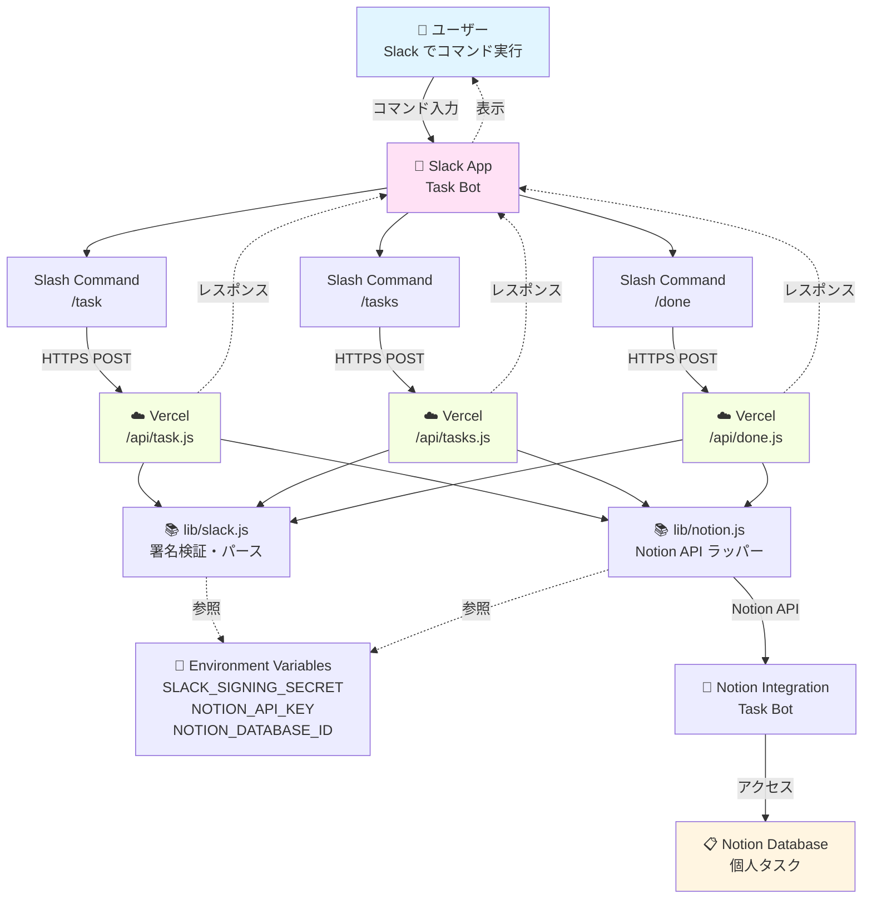
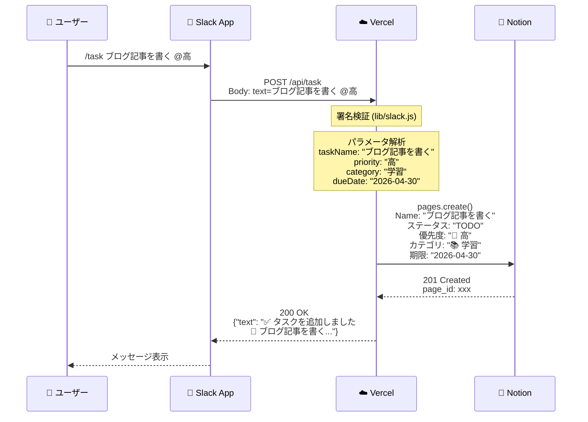
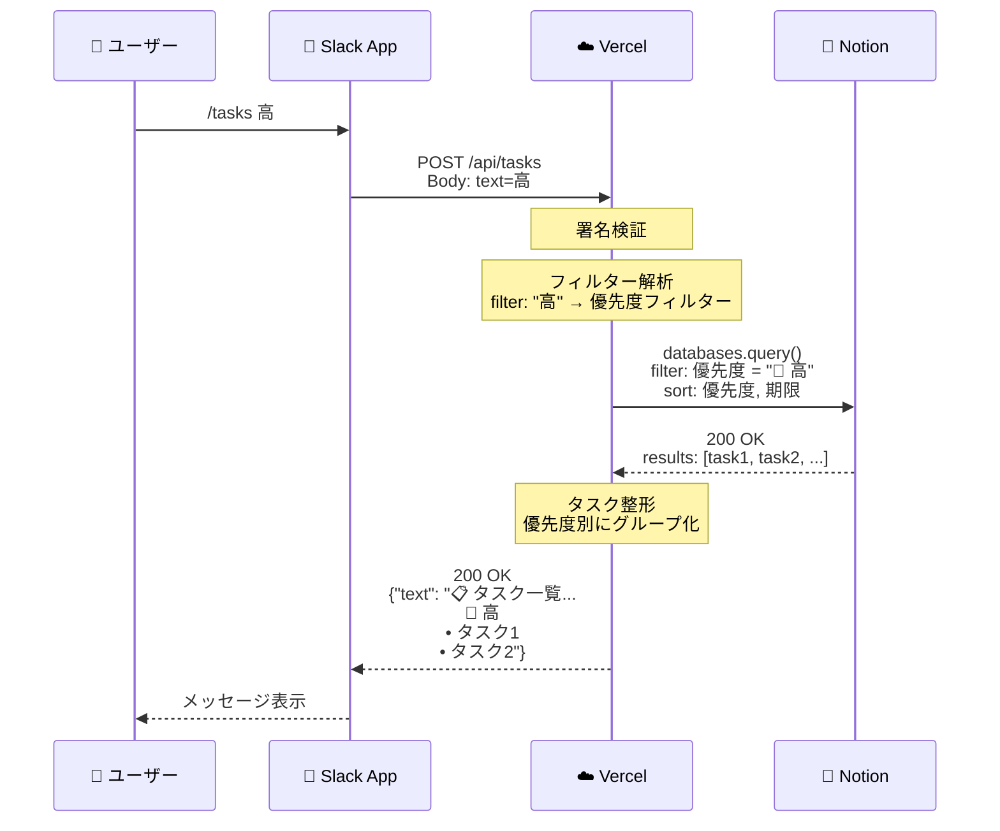
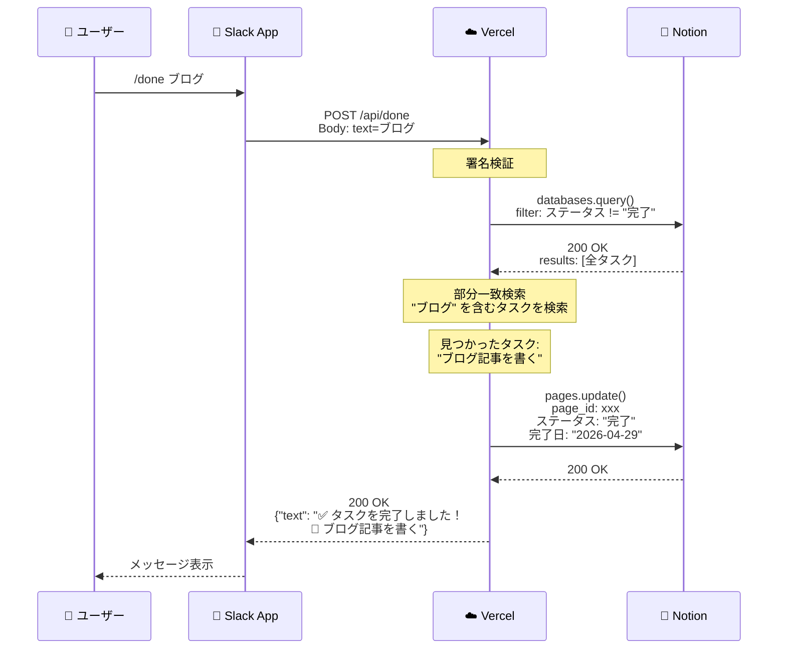
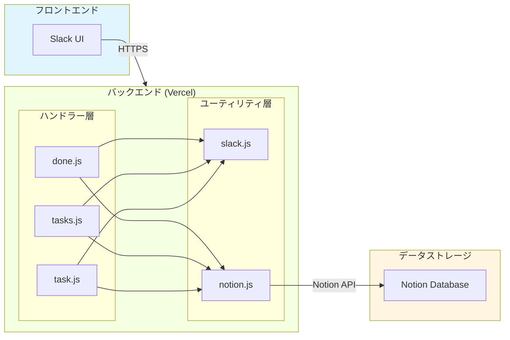
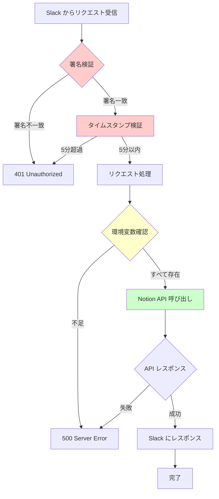
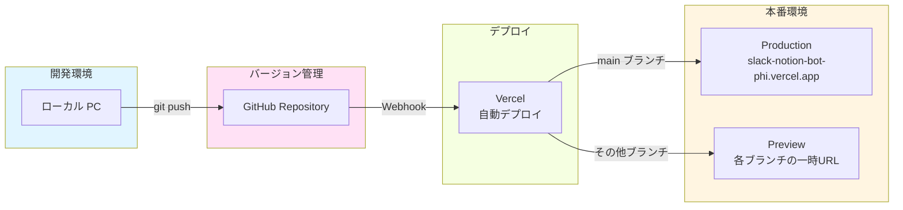
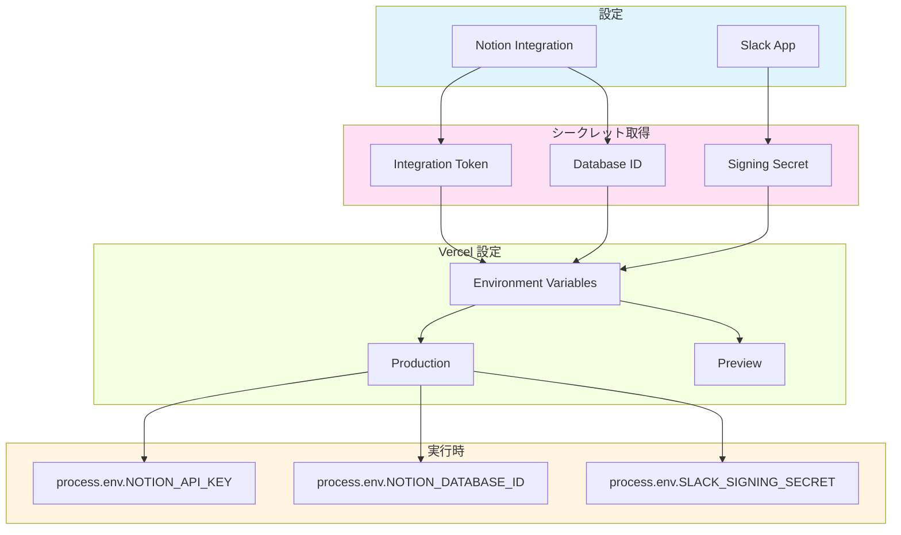
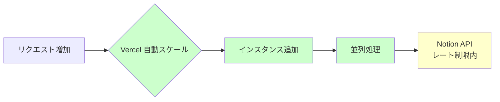

# システムアーキテクチャ

## 📊 全体構成図

---

## 🔄 データフロー図

### /task コマンドの処理フロー

### /tasks コマンドの処理フロー

### /done コマンドの処理フロー

---

## 🏗️ コンポーネント構成

---

## 🔐 セキュリティフロー

---

## 📦 デプロイアーキテクチャ

---

## 🔄 環境変数の流れ

---

## 🎯 技術スタック

| レイヤー | 技術 | 用途 |
|---------|------|------|
| **フロントエンド** | Slack | ユーザーインターフェース |
| **API Gateway** | Slack App | Slash Commands ルーティング |
| **バックエンド** | Vercel Serverless (Node.js 24.x) | ビジネスロジック |
| **データストレージ** | Notion Database | タスクデータ永続化 |
| **認証** | HMAC-SHA256 署名検証 | リクエスト検証 |
| **デプロイ** | Vercel + GitHub | CI/CD |

---

## 📊 パフォーマンス特性

| 指標 | 値 | 備考 |
|-----|-----|------|
| **Cold Start** | 1〜2秒 | 初回リクエスト時 |
| **Warm Request** | 0.3〜0.5秒 | 2回目以降 |
| **メモリ使用量** | 234MB / 2048MB | 約11% |
| **同時実行数** | 制限なし | Vercel Hobby プラン |
| **月間リクエスト数** | ~450回 / 100万回 | 0.045% 使用 |

---

## 🔄 スケーラビリティ

**Notion API のレート制限:**
- 平均: 3リクエスト/秒
- バースト: 最大10リクエスト/秒
- 現在の使用: 約0.005リクエスト/秒（余裕あり）

---

## 📝 まとめ

このアーキテクチャは以下の特徴を持ちます:

- ✅ **サーバーレス** - メンテナンス不要
- ✅ **スケーラブル** - 自動スケーリング
- ✅ **高速** - 0.3〜2秒のレスポンス
- ✅ **セキュア** - 署名検証 + 暗号化
- ✅ **無料** - 完全に無料枠内で運用可能
