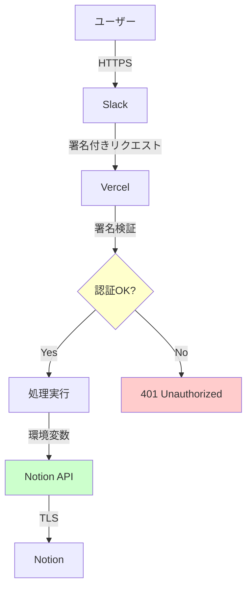
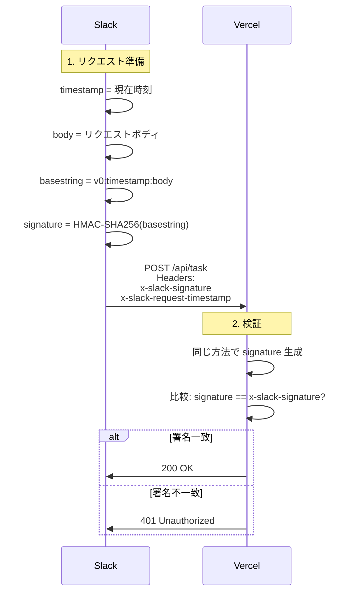
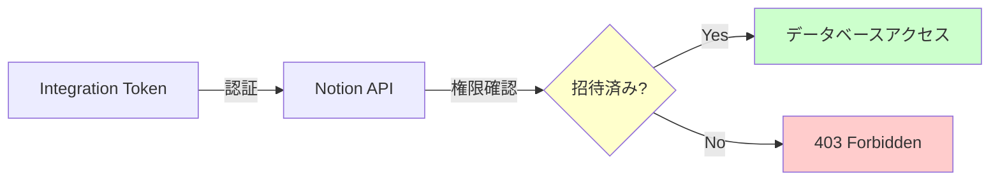
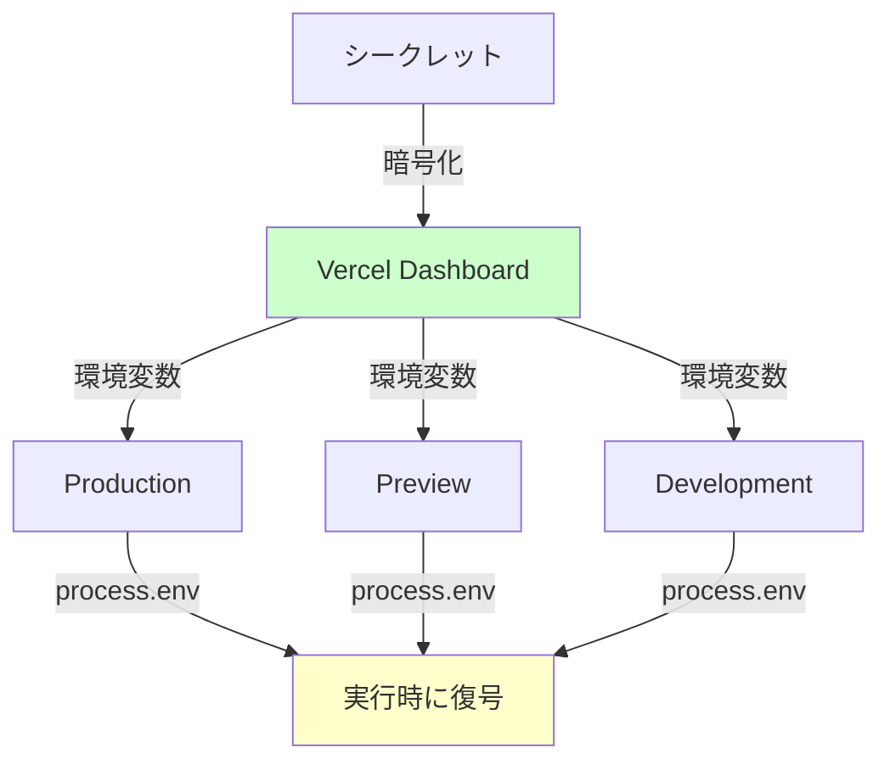
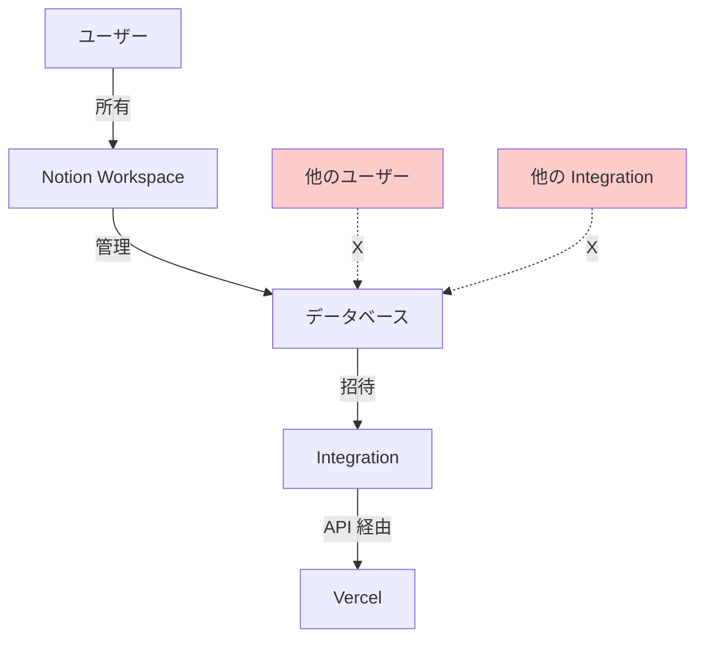

# セキュリティ設計

このドキュメントでは、システムのセキュリティ対策とベストプラクティスについて説明します。

---

## 📋 目次

1. [セキュリティ概要](#セキュリティ概要)
2. [認証・認可](#認証認可)
3. [データ保護](#データ保護)
4. [ベストプラクティス](#ベストプラクティス)
5. [脅威モデル](#脅威モデル)

---

## セキュリティ概要

### セキュリティレイヤー



### セキュリティの3層構造

1. **通信層**: HTTPS/TLS による暗号化
2. **認証層**: Slack 署名検証
3. **認可層**: Notion Integration による権限管理

---

## 認証・認可

### Slack 署名検証

#### 仕組み



#### 実装

```javascript
function verifySlackRequest(req) {
  const slackSignature = req.headers['x-slack-signature'];
  const timestamp = req.headers['x-slack-request-timestamp'];
  const signingSecret = process.env.SLACK_SIGNING_SECRET;

  // 1. タイムスタンプチェック (5分以内)
  const time = Math.floor(new Date().getTime() / 1000);
  if (Math.abs(time - timestamp) > 300) {
    return false;  // リプレイ攻撃対策
  }

  // 2. HMAC-SHA256 で署名生成
  const sigBasestring = `v0:${timestamp}:${bodyString}`;
  const mySignature = 'v0=' + crypto
    .createHmac('sha256', signingSecret)
    .update(sigBasestring, 'utf8')
    .digest('hex');

  // 3. タイミング安全な比較
  return crypto.timingSafeEqual(
    Buffer.from(mySignature, 'utf8'),
    Buffer.from(slackSignature, 'utf8')
  );
}
```

#### セキュリティ対策

| 脅威 | 対策 | 説明 |
|-----|------|------|
| **なりすまし** | 署名検証 | HMAC-SHA256 で送信元を検証 |
| **リプレイ攻撃** | タイムスタンプ | 5分以内のリクエストのみ受付 |
| **タイミング攻撃** | timingSafeEqual | 一定時間での比較 |

---

### Notion API 認証

#### Integration Token

```
ntn_xxxxxxxxxxxxxxxxxxxxxxxxxxxxxxxxxxxx
または
secret_xxxxxxxxxxxxxxxxxxxxxxxxxxxxxxxxxxxx
```

**特徴:**
- Integration 専用の API トークン
- Workspace レベルの権限
- データベースごとに招待が必要

#### 権限モデル



**セキュリティ上の利点:**
- データベースごとに権限を制限可能
- ユーザーアカウントとは独立
- 取り消しが容易

---

## データ保護

### 環境変数の管理

#### 保存場所



#### 保護レベル

| 環境変数 | 暗号化 | Git 管理 | 表示 |
|---------|-------|---------|------|
| **Vercel Dashboard** | ✅ Yes | ❌ No | 🔒 隠蔽 |
| **GitHub Secrets** | ✅ Yes | ❌ No | 🔒 隠蔽 |
| **.env.local** | ❌ No | ❌ No (.gitignore) | ⚠️ 平文 |
| **コード内** | ❌ No | ❌ **絶対NG** | ⚠️ 平文 |

---

### データの暗号化

#### 通信の暗号化

```
ユーザー → Slack: HTTPS (TLS 1.3)
Slack → Vercel: HTTPS (TLS 1.3)
Vercel → Notion: HTTPS (TLS 1.3)
```

**すべて TLS で暗号化** ✅

#### 保存データの暗号化

| データ | 保存場所 | 暗号化 |
|-------|---------|--------|
| **タスク内容** | Notion | ✅ Yes (at-rest) |
| **環境変数** | Vercel | ✅ Yes |
| **ログ** | Vercel | ✅ Yes |

---

### アクセス制御

#### Notion データベース



**原則:**
- Integration は明示的に招待されたデータベースのみアクセス可能
- 他のデータベースには一切アクセスできない

---

## ベストプラクティス

### 1. シークレット管理

#### ❌ 悪い例

```javascript
// コードに直接記述（絶対NG）
const NOTION_API_KEY = 'secret_abc123...';

// GitHub にコミット（絶対NG）
git add .env
git commit -m "Add env"
```

#### ✅ 良い例

```javascript
// 環境変数から取得
const NOTION_API_KEY = process.env.NOTION_API_KEY;

// .gitignore に追加
.env
.env.local
.env.*.local
```

---

### 2. エラーハンドリング

#### ❌ 悪い例

```javascript
// エラーメッセージにシークレットを含める
catch (error) {
  console.log(`Error: ${error.message}`);
  // → "Invalid token: secret_abc123..." が表示される
}
```

#### ✅ 良い例

```javascript
// シークレットを隠す
catch (error) {
  console.error('API error:', error.code);
  return res.status(500).json({
    error: 'An error occurred'  // 詳細は隠す
  });
}
```

---

### 3. ログ管理

#### ❌ 悪い例

```javascript
// リクエストボディをそのままログ
console.log('Request:', req.body);
// → トークンが含まれる可能性
```

#### ✅ 良い例

```javascript
// 必要な情報のみログ
console.log('Command:', {
  user: req.body.user_name,
  command: req.body.command,
  // トークンは含めない
});
```

---

### 4. 最小権限の原則

#### Notion Integration

```
必要な権限のみ付与:
✅ Read content
✅ Update content
✅ Insert content
❌ Delete content (不要)
❌ Manage members (不要)
```

#### Slack App

```
必要なスコープのみ:
✅ commands (Slash Commands)
❌ chat:write (不要)
❌ users:read (不要)
```

---

### 5. 定期的なローテーション

| シークレット | ローテーション推奨 |
|------------|-----------------|
| **Notion Integration Token** | 6ヶ月ごと |
| **Slack Signing Secret** | 変更時 |
| **Vercel 環境変数** | トークン更新時 |

---

## 脅威モデル

### 想定される脅威と対策

#### 1. なりすまし攻撃

**脅威:** 攻撃者が Slack になりすましてリクエストを送信

**対策:**
- ✅ HMAC-SHA256 署名検証
- ✅ Signing Secret の秘匿
- ✅ タイムスタンプによるリプレイ攻撃防止

**リスクレベル:** 🟢 低

---

#### 2. トークン漏洩

**脅威:** Notion Integration Token が漏洩

**影響:**
- データベースの読み取り・変更
- ただし、招待されたDBのみ

**対策:**
- ✅ 環境変数で管理（コードに含めない）
- ✅ GitHub に push しない (.gitignore)
- ✅ 最小権限の原則
- ✅ 定期的なローテーション

**リスクレベル:** 🟡 中（影響範囲は限定的）

---

#### 3. 中間者攻撃 (MITM)

**脅威:** 通信を傍受してデータを盗聴

**対策:**
- ✅ HTTPS/TLS 1.3 による暗号化
- ✅ 証明書検証

**リスクレベル:** 🟢 低

---

#### 4. サービス拒否攻撃 (DoS)

**脅威:** 大量のリクエストでサービス停止

**対策:**
- ✅ Vercel の自動スケーリング
- ✅ Notion API のレート制限
- ⚠️ Slack の Slash Command は認証済みユーザーのみ

**リスクレベル:** 🟢 低（Slack 経由のため）

---

#### 5. インジェクション攻撃

**脅威:** 悪意のある入力でシステムを侵害

**対策:**
- ✅ Notion API は SQL を使用しない（NoSQL）
- ✅ 入力は API 経由で処理（直接 DB 操作なし）
- ✅ パラメータは型チェック済み

**リスクレベル:** 🟢 低

---

## セキュリティチェックリスト

### デプロイ前

- [ ] 環境変数が `.gitignore` に追加されている
- [ ] シークレットがコードに含まれていない
- [ ] Notion Integration が必要最小限の権限のみ
- [ ] Slack App が必要なスコープのみ
- [ ] HTTPS が有効

### デプロイ後

- [ ] Vercel の環境変数が正しく設定されている
- [ ] Notion Integration が DB に招待されている
- [ ] Slack の署名検証が動作している
- [ ] エラーメッセージにシークレットが含まれていない

### 定期的な確認

- [ ] トークンの定期ローテーション（6ヶ月）
- [ ] 不要な Integration の削除
- [ ] アクセスログの確認
- [ ] 依存パッケージの更新

---

## インシデント対応

### トークンが漏洩した場合

#### 1. 即座に無効化

**Notion:**
1. https://www.notion.so/my-integrations
2. Integration を削除または再生成

**Slack:**
1. https://api.slack.com/apps
2. App を削除または Signing Secret を再生成

#### 2. 新しいトークンを発行

1. 新しい Integration を作成
2. 新しいトークンを取得
3. Vercel の環境変数を更新
4. 再デプロイ

#### 3. 影響範囲の確認

- Notion のアクセスログを確認
- Vercel のログで不審なアクセスを確認
- 必要に応じてデータを監査

---

## セキュリティ監査

### 自動チェック

```bash
# 依存パッケージの脆弱性チェック
npm audit

# 修正
npm audit fix
```

### 手動チェック

1. **コードレビュー:**
   - シークレットが含まれていないか
   - エラーハンドリングが適切か

2. **設定レビュー:**
   - 環境変数が正しいか
   - 権限が最小限か

3. **ログレビュー:**
   - 不審なアクセスがないか
   - エラー率が正常か

---

## 参考資料

- [Slack Security](https://api.slack.com/authentication/verifying-requests-from-slack)
- [Notion Security](https://www.notion.so/help/security-and-privacy)
- [Vercel Security](https://vercel.com/docs/concepts/security)
- [OWASP Top 10](https://owasp.org/www-project-top-ten/)

---

## まとめ

このシステムは以下のセキュリティ対策を実装しています:

✅ **認証**: Slack 署名検証  
✅ **暗号化**: HTTPS/TLS 1.3  
✅ **権限管理**: Notion Integration  
✅ **シークレット管理**: Vercel 環境変数  
✅ **最小権限**: 必要な権限のみ  

**セキュリティレベル**: 🟢 **高**
